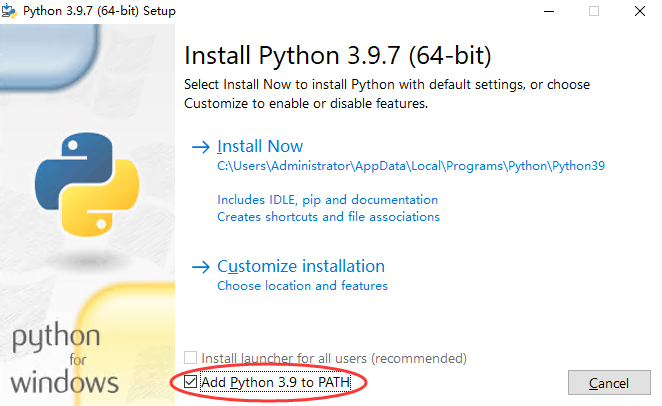
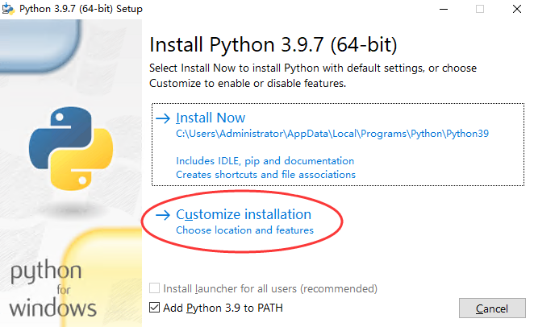
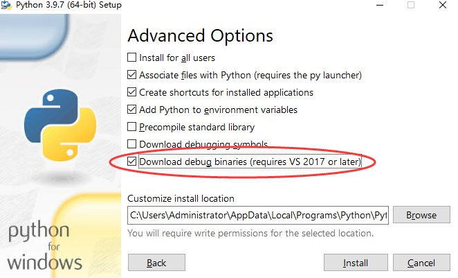
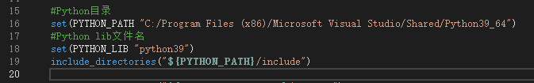

# MCRCONnogui

## 前置

### Python3.9或以上

#### 安装
1. 把pip勾上  

2. 点击Customize installation  

3. 把debug勾上  

4. 其他按自己喜好和需求修改

#### 修改

1. 在[CMakeLists.txt](./CMakeLists.txt)中修改PYTHON_PATH为Python路径
2. 在[CMakeLists.txt](./CMakeLists.txt)中修改PYTHON_LIB为Python的名字加版本，例如`python39`

## 构建
直接无脑构建就完事了

## 运行
直接无脑运行就完事了
